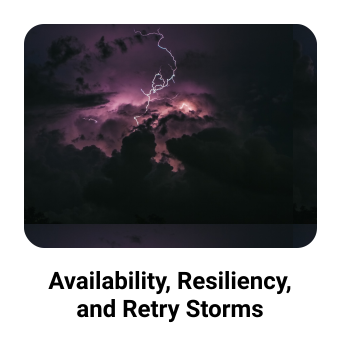

<h3>Hey, there! 👋</h3>
<h3>I'm a developer, entrepreneur, and public speaker. I love learning new things, and I try share them on my blog &amp; twitter.</h3>
 

	
	
	
	
	

<h3 align="left">My Top Languages and Tools:</h3>

	
	
	
	
	
	
	
	
	
	
	

<h3 align="left">My Top Blog Posts:</h3>

	

